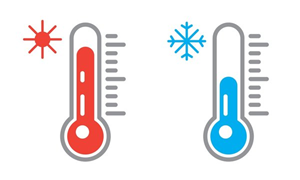

<br>

<!-- INSERT ICON AND TITLE -->
<div align="center">
  
  <a name="top"></a>
  <h3 align="center">Temperature Monitoring System</h3>
</div>

<br>

<!-- TABLE OF CONTENTS -->
<details>
  <summary>Table of Contents</summary>
  <ol>
    <li><a href="#project-summary">Project Summary</a></li>
    <li><a href="#getting-started">Getting Started</a></li>
    <li><a href="#usage">Usage</a></li>
    <li><a href="#run-application">Run Application</a></li>
    <li><a href="#license">License</a></li>
    <li><a href="#contact">Contact</a></li>
    <li><a href="#acknowledgments">Acknowledgments</a></li>
  </ol>
</details>

<br><br>


<!-- PROJECT SUMMARY -->
## Project Summary
This is a temperature monitoring application developed to monitor temperature sensors and record variances. The application is designed to allow multiple monitors to be added to the system for continuous monitoring of different locations.

System functionality:
* Continual monitoring of multiple temperature sensors,
* Ability to record temperature readings for analysis,
* Ability to enable email alerts when predefined temperature thresholds are breached.

<p align="right">(<a href="#top">back to top</a>)</p>

<br>


<!-- GETTING STARTED -->
## Getting Started
Before running the application please ensure all temperature sensors are transmitting as expected on an IP Network using UDP (User Datagram Protocol).

#### Recommended Sensors:
* Raspberry Pi Zero-W (RPI) with wireless LAN and Bluetooth
  * 1-wire sensor attached 

<p align="right">(<a href="#top">back to top</a>)</p>

<br>


<!-- EXAMPLES -->
## Usage
This application was designed to be widely used in various industries to monitor temperature. This help ensure cost efficiency, product safety, and quality. 

_For more examples, please refer to [Ixthus](https://www.ixthus.co.uk/news-media/blog-archive/temperature-sensor-applications)_
website for more details
<p align="right">(<a href="#top">back to top</a>)</p>

<br>


<!-- Run Application -->
## Run Application:
To enable Temperature Sensors Application :

Option 1:
  1. Navigate to application directory,
  2. Open Wndows - terminal windows (shift + right click) 
  3. Run following commands
        ```sh
        python3 main.py
        ```
Option 2:
  1. The application can also be run from any Integrated Development Environment (IDE). Simple import the application & run main() class.

<br>

#### Demo Sensors:
For demo purposes, predefined classes has been included in this release to allows for sensor data to be imitated.

To enable demo sensors:
  1. Navigate to application directory,
  2. Open Wndows - terminal windows (shift + right click) 
  3. Run following commands (seperate terminal window will be needed)
        ```sh
        python3 udp_client1.py
        ```
        ```sh
        python3 udp_client2.py
        ```
<p align="right">(<a href="#top">back to top</a>)</p>

<br>


<!-- LICENSE -->
## License

Distributed under the Donegal ATU License. See `LICENSE` for more information.

<p align="right">(<a href="#top">back to top</a>)</p>

<br>


<!-- CONTACT -->
## Contact
* Name : PJ McMenamin
* Email : L00186132.ATU@gmail.com

<p align="right">(<a href="#top">back to top</a>)</p>

<br>


<!-- Acknowledgments -->
## Acknowledgments
I would like to extend my appreciation to ATU Lecturer - John ORaw who have provided training, guidance and insights throughout the project. His  expertise, feedback and experience have been valuable and greatly contributed to the overall success of this project.

<p align="right">(<a href="#top">back to top</a>)</p>