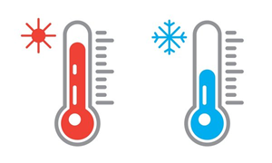

 

<!-- INSERT ICON AND TITLE -->

  
  
  <h3 align="center">Status Report</h3>

 

<!-- TABLE OF CONTENTS -->

  
Table of Contents

  <ol>
    <li><a href="#project-status">Project Status</a></li>
    <li><a href="#highlights">HighLights</a></li>
    <li><a href="#risks">Risks</a></li>
    <li><a href="#improvements">Improvements</a></li>
    <li><a href="#other-updates">Other Updates</a></li>
  </ol>

  

<!-- PROJECT STATUS -->
## Project Status
This project contains a fully working codebase for a temperature monitor system. The code has been designed to monitor network data transfer across a network using UDP (User Datagram Protocol). More details can be found in following sections.

(<a href="#top">back to top</a>)

<!-- HIGHLIGHTS -->
### HighLights

*All code listed is this repository is fully working to specifications*

Assignment1\
├─ config\
&nbsp;|&nbsp;&nbsp;&nbsp;&nbsp;&nbsp;&nbsp;├─ *properties_email.py*\
&nbsp;|&nbsp;&nbsp;&nbsp;&nbsp;&nbsp;&nbsp;├─ *properties_server.py*\
&nbsp;|&nbsp;&nbsp;&nbsp;&nbsp;&nbsp;&nbsp;├─ *properties_temperature.py*\
&nbsp;|&nbsp;&nbsp;&nbsp;&nbsp;&nbsp;&nbsp;└─ *properties_udp.py*\
├─ docs\
&nbsp;|&nbsp;&nbsp;&nbsp;&nbsp;&nbsp;&nbsp;├─ *Status.md*\
├─ images\
&nbsp;|&nbsp;&nbsp;&nbsp;&nbsp;&nbsp;&nbsp;├─ *temp_Logo.png.md*\
├─ src\
&nbsp;|&nbsp;&nbsp;&nbsp;&nbsp;&nbsp;&nbsp;&nbsp;├─ alert\
&nbsp;|&nbsp;&nbsp;&nbsp;&nbsp;&nbsp;&nbsp;&nbsp;&nbsp;|&nbsp;&nbsp;&nbsp;&nbsp;&nbsp;└─ *generate_email_test.py*\
&nbsp;|&nbsp;&nbsp;&nbsp;&nbsp;&nbsp;&nbsp;&nbsp;&nbsp;|&nbsp;&nbsp;&nbsp;&nbsp;&nbsp;└─ *generate_email.py*\
&nbsp;|&nbsp;&nbsp;&nbsp;&nbsp;&nbsp;&nbsp;&nbsp;├─ reporting\
&nbsp;|&nbsp;&nbsp;&nbsp;&nbsp;&nbsp;&nbsp;&nbsp;&nbsp;|&nbsp;&nbsp;&nbsp;&nbsp;&nbsp;&nbsp;└─ *generate_logs_test.py*\
&nbsp;|&nbsp;&nbsp;&nbsp;&nbsp;&nbsp;&nbsp;&nbsp;&nbsp;|&nbsp;&nbsp;&nbsp;&nbsp;&nbsp;&nbsp;└─ *generate_logs.py*\
&nbsp;|&nbsp;&nbsp;&nbsp;&nbsp;&nbsp;&nbsp;&nbsp;└─ server\
&nbsp;|&nbsp;&nbsp;&nbsp;&nbsp;&nbsp;&nbsp;&nbsp;&nbsp;&nbsp;&nbsp;&nbsp;&nbsp;&nbsp;&nbsp;&nbsp;└─ *udp_server.py*\
└─ *main.py*

 

* *properties_email.py* - for easy modification of email parameters,
* *properties_server.py* - for easy modification of server parameters,
* *properties_temperature.py* - for easy modification of temperature threshold,
* *properties_udp.py* - for easy modification of udp network parameters,
* *generate_email_test.py* - unittest for testing email functionality,
* *generate_email.py* - allows for ability to send email notifications,
* *generate_logs_test.py* - unittest for testing logging functionality,
* *generate_logs.py* - allows for logging of received network data packets,
* *upd_server.py* - allows for continual monitoring of network traffic,
* *main.py* - starts application,

(<a href="#top">back to top</a>)

### Risks
* Load testing should be carried out to ensure application runs as expected,
* Improve Error handling checks across all modules,

(<a href="#top">back to top</a>)

### Improvements

* Improve error handling,
* Improve email notification - to handle multiple notification,
* Improve unittest tests

(<a href="#top">back to top</a>)

### Other Updates

* n/a

(<a href="#top">back to top</a>)

## pylint Results

Class | Results | Comments
---|---|---
properties_email.py | Your code has been rated at 10.00/10 | 
properties_server.py | Your code has been rated at 10.00/10 | 
properties_temperature.py | Your code has been rated at 10.00/10 | 
properties_udp.py | Your code has been rated at 0.00/10 | 
generate_email.py | Your code has been rated at 9.50/10 | Too few public methods (1/2) (too-few-public-methods)
generate_logs.py | Your code has been rated at 9.41/10 | Consider using 'sys.exit' instead (consider-using-sys-exit)   Formatting a regular string which could be an f-string (consider-using-f-string)
udp_server.py | Your code has been rated at 4.35/10 | Unable to import 'config.properties_udp' (import-error)   Unable to import 'config.properties_server' (import-error)   Unable to import 'config.properties_temperature' (import-error)   Unable to import 'src.reporting.generate_logs' (import-error)   Unable to import 'src.alert.generate_email' (import-error)   Unused variable 'addr' (unused-variable)
main.py | Your code has been rated at 10.00/10 |

(<a href="#top">back to top</a>)
